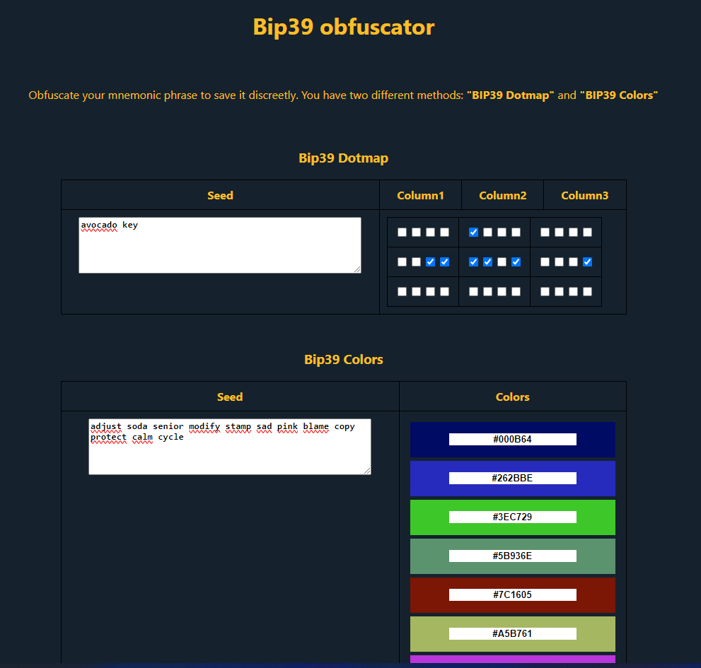

# Bip39 Obfuscator

## Obfuscate your mnemonic phrase to save it discreetly
You have two different methods: **"BIP39 Dotmap"** and **"BIP39 Colors"**

### BIP39 Dotmap

**amazing** &ensp;=> `| ○○○○ | ○○●● | ●●●● |`\
**key** &ensp;&ensp;&ensp;&ensp;&ensp; => `| ○○●● | ●●○● | ○○○● |`\
**avocado** &ensp;=> `| ○○○○ | ●○○○ | ○○○○ |`

For more information, please visit the official [website](https://github.com/OneKeyHQ/bip39-dotmap).

### BIP39 Colors

BIP39Colors offers a BIP39 compatibile secure approach to storing cryptocurrency seeds.

For more information, please visit the official [website](https://enteropositivo.github.io/bip39colors/#colorstobip39).

## Start project

There are no external dependencies in this project. Everything has been coded in vanilla JavaScript using the official methods of Bip39-dotmap and Bip39-color.

**To avoid exposing your seed, I recommend downloading the project as a .zip file and running it locally (offline).**
1. `npm i`
2. `npm run dev`